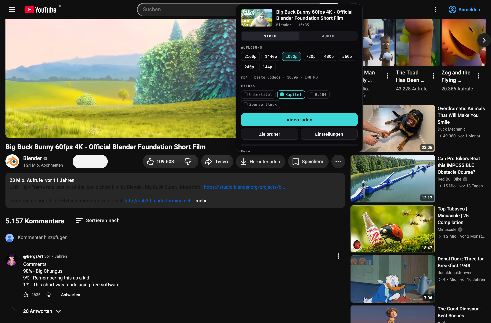
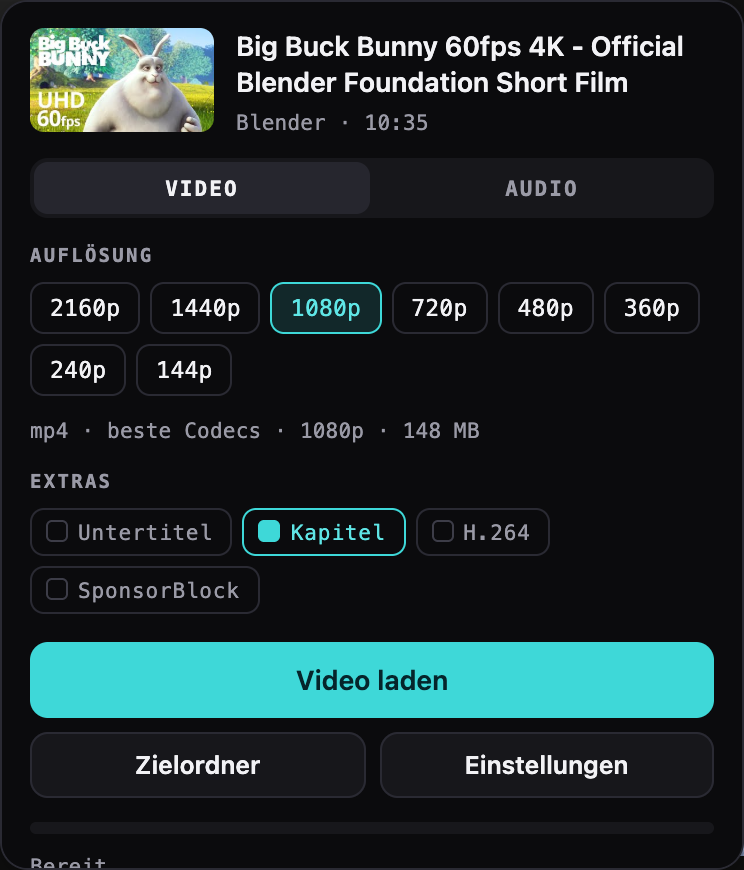
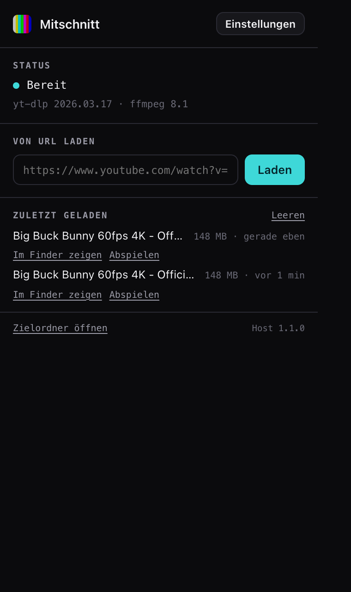
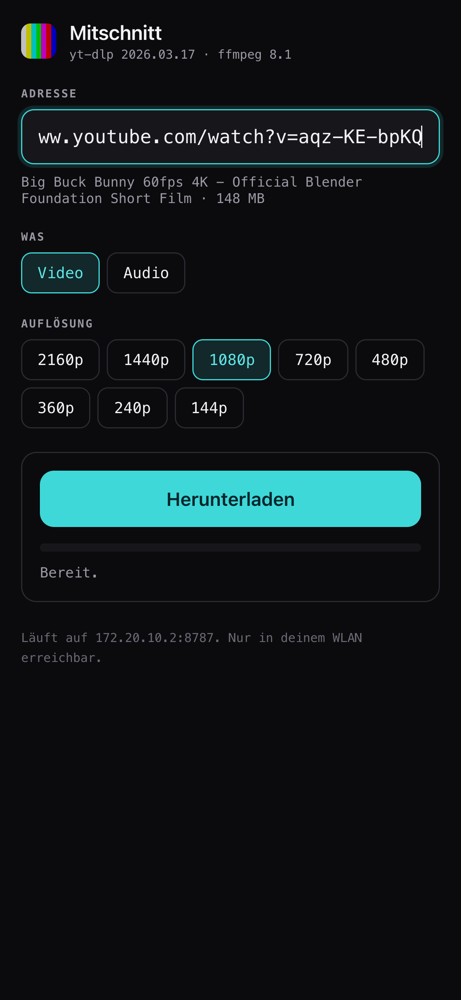

<div align="center">

# Mitschnitt

**Ersetzt den Download-Button unter Videos durch einen eigenen.**

Der Download läuft auf deinem Rechner — über [yt-dlp](https://github.com/yt-dlp/yt-dlp)
und [FFmpeg](https://ffmpeg.org). Kein fremder Server, keine Wasserzeichen,
keine Wartezeit, keine Auflösungsgrenze.

<br>

### [⬇︎ Für macOS herunterladen](https://github.com/yannik080/mitschnitt/releases/latest/download/Mitschnitt-macOS.zip) &nbsp;·&nbsp; [⬇︎ Für Windows herunterladen](https://github.com/yannik080/mitschnitt/releases/latest/download/Mitschnitt-Windows.zip)

<br>



</div>

<br>

> [!IMPORTANT]
> **Wofür das gedacht ist.** Für eigene Videos, frei lizenzierte Inhalte und
> Material, für das du die Rechte oder eine Erlaubnis hast.
>
> Die Nutzungsbedingungen von Videoplattformen untersagen das Herunterladen in
> aller Regel. Nach der Rechtsprechung des OLG Hamburg (Urteil vom 21.11.2024,
> Az. 5 U 54/23, seit Oktober 2025 rechtskräftig) ist die Umgehung technischer
> Schutzmaßnahmen zudem **nicht** durch die Privatkopieschranke des § 53 UrhG
> gedeckt. Was du mit diesem Werkzeug machst, liegt in deiner Verantwortung.

<br>

## Installieren

Zwei Schritte: einmal die Einrichtung starten, einmal die Erweiterung in
Chrome laden. Zusammen keine zwei Minuten.

### Schritt 1 — Einrichtung starten

Das heruntergeladene ZIP entpacken, dann darin doppelklicken auf:

| System | Datei |
|---|---|
| macOS | `Installieren (macOS).command` |
| Windows | `Installieren (Windows).bat` |

<details>
<summary><b>macOS meldet „nicht verifizierter Entwickler"</b></summary>

<br>

Normal — die Datei ist nicht bei Apple registriert (das kostet 99 $ im Jahr).
Statt doppelt zu klicken: **Rechtsklick** auf die Datei → **Öffnen** → im
Dialog noch einmal auf **Öffnen**. Ab dann geht auch der Doppelklick.
</details>

<details>
<summary><b>Windows meldet „Der Computer wurde geschützt"</b></summary>

<br>

Ebenfalls normal. Auf **Weitere Informationen** klicken, dann auf
**Trotzdem ausführen**.
</details>

Es öffnet sich ein Fenster, das yt-dlp und FFmpeg holt, falls sie fehlen
(beim ersten Mal einige hundert MB), alles einrichtet und zum Schluss prüft,
ob es läuft. Administratorrechte braucht es nicht.

### Schritt 2 — Erweiterung in Chrome laden

Chrome erlaubt Erweiterungen von außerhalb des Web Store nur über den
Entwicklermodus. Drei Klicks:

1. Chrome öffnen, in die Adresszeile eingeben: **`chrome://extensions`**
2. Rechts oben den Schalter **Entwicklermodus** einschalten
3. Links oben auf **Entpackte Erweiterung laden** klicken und den Ordner
   **`extension`** aus dem entpackten Verzeichnis auswählen

Fertig. Eine Videoseite neu laden — der Download-Button unter dem Video
gehört ab jetzt dir.

> **Den entpackten Ordner nicht verschieben oder löschen.** Chrome und die
> Einrichtung merken sich den Ort. Zieht er doch um, einfach die Einrichtung
> noch einmal starten.

<br>

## Was es kann



**Nur die Auflösungen, die es wirklich gibt.** Statt einer festen Leiter mit
ausgegrauten Einträgen zeigt das Panel, was für dieses Video vorliegt.

**Die Größenangabe stimmt.** Sie ist keine Schätzung: yt-dlp wird gefragt,
welche Formate es nähme, und deren Größen werden addiert. Im Test weicht die
Ankündigung um 0,3 % von der fertigen Datei ab. Keine Kleinigkeit — dieselbe
Auflösung wird oft in drei Codecs angeboten, die um den Faktor zwei
auseinanderliegen.

**Audio getrennt.** MP3, M4A, Opus, FLAC oder WAV, mit Cover und Metadaten.

**Extras.** Untertitel einbetten, Kapitelmarken übernehmen, H.264 erzwingen
(für Final Cut und QuickTime), SponsorBlock-Segmente entfernen.

**Der Fortschritt sitzt im Button.** Panel zuklappen und trotzdem sehen, wo
es steht.

<br clear="right">

### Unterbrochene Downloads laufen weiter

Der Teil, der bei den meisten Downloadern fehlt.

Reißt die Verbindung ab, bleibt das bereits Geladene liegen. Es wird 30-mal
mit wachsender Pause erneut versucht; reicht das nicht, merkt sich die
Erweiterung den Download und nimmt ihn von allein wieder auf, sobald wieder
Netz da ist — **an derselben Stelle, nicht von vorn**.

Von Hand abgebrochene Downloads laufen nie von selbst weiter. Ein Abbruch ist
eine Entscheidung, keine Störung. Sie stehen im Popup unter „Unterbrochen"
mit **Fortsetzen** und **Verwerfen**.

<br>

<div align="center">

&nbsp;&nbsp;

</div>

<br>

## Auch auf dem iPhone



Auf iOS lässt sich yt-dlp nicht ausführen — kein Prozessstart, kein FFmpeg.
Wer trotzdem in voller Auflösung laden will, braucht einen Rechner, der die
Arbeit macht. Genau das ist hier schon eingerichtet.

Doppelklick auf **`Für iPhone einrichten (macOS).command`**. Der Mac öffnet
dann einen kleinen Dienst **nur im eigenen WLAN**, abgesichert mit einem
Schlüssel. Danach gibt es zwei Wege:

**Safari.** Die angezeigte Adresse auf dem iPhone öffnen — dieselbe Auswahl,
dieselben exakten Größen, derselbe Fortschrittsbalken. Über „Zum
Home-Bildschirm" liegt es wie eine App auf dem Gerät. Nichts einzurichten.

**Kurzbefehl im Teilen-Menü.** Damit lädst du direkt aus der YouTube-App
heraus. Vier Aktionen, die Einrichtung zeigt sie mit deiner Adresse und
deinem Schlüssel fertig zum Abtippen:

1. Neuer Kurzbefehl, **Im Teilen-Menü anzeigen** an, Typ **URLs**
2. Aktion **Text**: `http://<deine-adresse>:8787/api/grab?t=<schlüssel>&height=1080&url=`
   und die Variable **Kurzbefehlseingabe** anhängen
3. Aktion **Inhalte von URL abrufen**
4. Aktion **In Fotos sichern** (oder **Datei sichern**)

Teilen in der YouTube-App → dein Kurzbefehl → das Video landet in Fotos.

<br clear="right">

Ein einziger Aufruf erledigt alles: der Mac lädt, führt Bild und Ton
zusammen und schickt die fertige Datei zurück. Für `height=` geht jede
vorhandene Stufe, `mode=audio` liefert stattdessen eine MP3.

> Der Dienst ist aus dem Internet **nicht** erreichbar, nur aus deinem WLAN,
> und ohne den Schlüssel antwortet er auf nichts. Abschalten jederzeit mit
> `scripts/iphone-uninstall-macos.sh` — danach ist der Port wieder zu.
>
> Beide Geräte müssen im **selben normalen WLAN** sein. Über einen
> iPhone-Hotspot funktioniert es nicht: das Telefon schickt Anfragen dann
> bevorzugt über Mobilfunk statt ins eigene Netz.
>
> Unter Windows gibt es diesen Teil noch nicht.

### Ganz ohne Rechner

Wer den Mac gar nicht einbeziehen will, kann yt-dlp direkt auf dem iPhone
laufen lassen — über die kostenlose Terminal-App **a-Shell**, für die es
auch ein FFmpeg gibt. Das ist eine Anleitung, keine Software:
**[docs/iphone-ohne-mac.md](docs/iphone-ohne-mac.md)**

<br>

## Wenn etwas nicht geht

Klick auf das Symbol in der Symbolleiste — dort steht, was fehlt.

| Es passiert | Das hilft |
|---|---|
| Popup sagt „Nicht bereit" | Einrichtung noch einmal starten. Ordner verschoben? |
| Kein Button unter dem Video | Seite neu laden (⌘R / Strg+R) |
| „yt-dlp ist zu alt" | Einstellungen → *yt-dlp aktualisieren* |
| Download bricht ständig ab | Einstellungen → *Gleichzeitige Teile* auf 1 |
| Altersbeschränktes Video | Wird nicht unterstützt |

Hilft gar nichts, steht die Antwort meist im Log:

```
macOS     ~/Library/Logs/Mitschnitt/host.log
          ~/Library/Logs/Mitschnitt/server.log   (Dienst fürs iPhone)
Windows   %LOCALAPPDATA%\Mitschnitt\Logs\host.log
```

<br>

## Wie es funktioniert

Eine Chrome-Erweiterung darf keine Programme starten — sonst könnte jede
Website beliebigen Code auf deinem Rechner ausführen. Deshalb gibt es einen
kleinen Vermittler, den Chrome bei Bedarf selbst startet:

```
┌─────────────┐   Native Messaging   ┌──────────────┐   ruft auf   ┌────────┐
│ Erweiterung │ ◄─── stdio / JSON ──►│  Python-Host │ ────────────►│ yt-dlp │
│    (MV3)    │                      │              │              │ FFmpeg │
└─────────────┘                      └──────────────┘              └────────┘
```

Genau diesen Vermittler meldet die Einrichtung bei Chrome an. Er schreibt nur
innerhalb deines Benutzerordners und schickt nichts nach außen.

<details>
<summary><b>Für Entwickler: Aufbau, Tests, Fallstricke</b></summary>

<br>

```
extension/
  manifest.json        MV3, feste ID über den öffentlichen Schlüssel
  background.js        Service Worker: Brücke zum Host, Jobs, Fortsetzen
  content/inject.js    Button und Panel, vollständig im Shadow Root
  popup/ options/      Status, Verlauf, Einstellungen
native-host/
  ytdl_host.py         spricht Native Messaging, ruft yt-dlp auf
  mitschnitt_server.py Begleitdienst fürs iPhone, nutzt denselben Code
scripts/               Einrichtung je System, Release-Bau
tests/                 Protokoll-, Fortsetz- und Browsertests
```

```bash
python3 tests/harness.py ping     # Host erreichbar?
python3 tests/test_resume.py      # setzt ein Abbruch wirklich fort?
npm install && node tests/e2e.mjs # ganze Kette in echtem Chrome (22 Prüfungen)
node tests/visual.mjs             # Aufnahmen der Oberfläche
bash scripts/build-release.sh     # Archive nach dist/
```

`e2e.mjs` startet ein eigenes Chrome-Profil, lädt die Erweiterung über
`Extensions.loadUnpacked` (das Flag `--load-extension` ist seit Chrome 137
wirkungslos), lädt ein 19-Sekunden-Video und prüft mit ffprobe, dass die
Datei Bild und Ton enthält — und dass die angekündigte Größe stimmt.

**Fallstricke, die je einen Fehlversuch gekostet haben:**

- Chrome startet den Host mit minimalem `PATH`. Homebrew liegt nicht darin,
  unter Windows praktisch nichts. Der Host sucht deshalb selbst.
- `--print` schaltet yt-dlp stillschweigend in den Simulationsmodus. Ohne
  `--no-simulate` lädt es nichts herunter.
- MV3-Service-Worker sterben nach 30 s Leerlauf und nehmen den Download mit.
  Der Host schickt deshalb alle 15 s einen Heartbeat, solange etwas läuft.
- Unter Windows schreibt stdout `\n` als `\r\n` und zerstört damit den
  Längenkopf des Protokolls — `msvcrt.setmode(..., O_BINARY)` ist Pflicht.
- Der Button liest Höhe, Rundung, Farbe und Schrift zur Laufzeit von einem
  echten Nachbarbutton ab. Abgeschriebene Zahlen veralten mit dem nächsten
  Umbau der Seite. Seine Breite ist eingefroren, sonst springt die ganze
  Leiste, sobald aus „Herunterladen" ein Prozentwert wird.

</details>

<br>

## Lizenz

[MIT](LICENSE) für diesen Code. yt-dlp (Unlicense) und FFmpeg (LGPL/GPL)
werden **nicht mitgeliefert**, sondern bei der Einrichtung von den
Projektseiten geholt und als eigenständige Programme aufgerufen.
